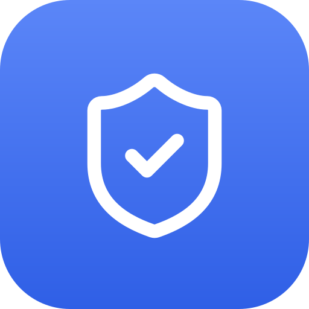

<div align="center">



# Uptime Guard

### Uptime monitoring with **zero servers**. Runs 100% on Cloudflare. **Free.**

Monitor your websites, APIs, TCP ports, DNS, TLS certificates, domains, cron jobs and multi-step
scripted flows - no VPS, no container, no monthly bill. Just a Cloudflare Worker, a database, and a
dashboard.

[](https://deploy.workers.cloudflare.com/?url=https://github.com/CalmRay-Solutions/uptime-guard)

[](./LICENSE)
[](https://workers.cloudflare.com/)
[](#why-uptime-guard)
[](./CONTRIBUTING.md)

### [▶ Try the live demo](https://vigil-demo.calmray.team) &nbsp;·&nbsp; password `demo` &nbsp;·&nbsp; [see a public status page](https://vigil-demo.calmray.team/status/demo)


</div>

---

## Why Uptime Guard?

Every other uptime tool makes you choose: **pay per monitor** (UptimeRobot, Pingdom, Better Uptime)
or **host it on a server you then have to monitor too** (Uptime Kuma on a VPS). Uptime Guard is
neither. It runs entirely on **Cloudflare Workers + D1**, so there's **nothing to keep alive** and,
for a typical fleet, **nothing to pay**.

|  | Uptime Guard | SaaS monitors | Self-hosted (VPS) |
|---|:---:|:---:|:---:|
| Monthly cost | **$0** | $$ per monitor | VPS bill |
| Server to maintain | **None** | - | You run it |
| Who monitors the monitor? | Cloudflare's edge | vendor | 🤷 nobody |
| Your data | **Your Cloudflare account** | vendor's cloud | your box |
| Deploy time | **~2 min, one click** | signup | provision + install |
| Public status page | ✅ built-in | often paid | varies |

> **No server. No monthly bill. No babysitting.** Push it to Cloudflare and forget it's there -
> until it pings you on Telegram because something you care about went down.

## Runs on Cloudflare's free tier

The whole thing fits inside Cloudflare's **free** limits for a real-world fleet:

- **Workers**: 100k requests/day free - a per-minute cron is ~1,440/day.
- **D1**: 5 GB storage + 5M row-reads/day free - history is rolled up daily and pruned.
- **Static assets**: the dashboard is served free from the same Worker.

Dozens of monitors, checked every minute, with 90 days of history - comfortably **$0/month**.

## Features

| | |
|---|---|
| **7 monitor types** | HTTP(S), TCP port, DNS record, TLS certificate expiry, domain (registrar) expiry, heartbeat (dead-man's switch), and multi-step custom scripts |
| **Alerts that escalate** | Telegram **+** desktop Web Push on down/recovery, with widening re-alerts (5m → 10m → 20m → 40m → hourly) and total downtime on recovery |
| **No false alarms** | A single failed check is re-confirmed in seconds before it ever pages you |
| **Real reliability data** | Per-service 24h / 7d / 30d / 90d uptime, incident history, and mean-time-to-recovery |
| **Public status pages** | Share a read-only page per project - no login, edge-cached, sanitized |
| **Installable PWA** | Add to your desktop/phone; push notifications work even when it's fully closed |
| **Locked down** | Password **+** TOTP login, rate-limiting, one-click session revocation |
| **Configure in-app** | Telegram bot/chat/thread and your authenticator are editable right in Settings |
| **Cloudflare-aware** | Detects CF-fronted hosts and shows a calm "CF Protected" state instead of false downs |

## Screenshots

<div align="center">

| Service detail - SLA windows & MTTR | Incident history |
|:--:|:--:|
|  |  |
| **Public status page** - shareable, no login | |
|  | |

</div>

## Deploy in ~2 minutes

### Option A - one click

[](https://deploy.workers.cloudflare.com/?url=https://github.com/CalmRay-Solutions/uptime-guard)

Cloudflare provisions the D1 database, builds the dashboard, and deploys the Worker. The deploy log
ends with your dashboard URL in a banner you can't miss:

```
=============================================================
| DEPLOYED - OPEN YOUR DASHBOARD AT:                        |
|                                                           |
|   >>  https://uptime-guard.your-name.workers.dev          |
|                                                           |
| First visit walks you through creating the owner account. |
=============================================================
```

Open it and the first-run wizard walks you through two steps: **set an owner password, then pair an
authenticator app.** Both are required, so the instance is never live with a single factor. No
secrets to set, no schema to run - the app initializes itself. (The banner comes from the `npm run deploy` script;
if the deploy step in the Cloudflare setup screen says `npx wrangler deploy`, change it to
`npm run deploy` to get it.)

### Option B - from your terminal

```bash
git clone https://github.com/CalmRay-Solutions/uptime-guard.git
cd uptime-guard/worker && npm install && npx wrangler login

# Create the database and paste the printed id into wrangler.toml
npx wrangler d1 create uptime-guard

# Build the dashboard + deploy the Worker in one command
# (prints your dashboard URL in a banner at the end)
cd .. && npm run deploy
```

Open the printed URL - the first visit shows a **"create your account"** wizard. Set a password,
scan the authenticator QR (keep the key it shows: it is your way back in if you lose the device),
then create a project and add your first monitor. Checks start within 60 seconds. The database
schema is created automatically, and the session secret is generated for you.

**Optional, all from the dashboard's Settings - never required:**
- **Re-pair two-factor auth** - scan a new QR to move TOTP to another device.
- **Telegram alerts** - paste a bot token + chat id (or set `TELEGRAM_BOT_TOKEN` / `TELEGRAM_CHAT_ID`).
- **Web Push** - add VAPID keys for desktop notifications.

**Lost your authenticator?** You own the database, so you can clear the pairing and sign in with the
password alone until you set up a new one:

```bash
npx wrangler d1 execute uptime-guard --remote --command "DELETE FROM settings WHERE key='totp_secret'"
```

## Architecture

```
┌────────────────────────┐        every 60s        ┌──────────────────┐
│  Cloudflare Worker      │ ── scheduled() cron ──▶ │  runs due checks  │
│  • REST API (/api/*)    │                         │  http/tcp/dns/tls │
│  • serves the dashboard │ ◀── records results ──  │  domain/heartbeat │
│  • Telegram + Web Push  │                         └──────────────────┘
└───────────┬────────────┘
            │ binds
      ┌─────▼─────┐   ┌──────────────────────────────┐
      │  D1 (SQL) │   │  React + Vite dashboard (SPA) │
      │  projects │   │  served from the same Worker  │
      │  services │   │  password + TOTP auth         │
      │  checks   │   └──────────────────────────────┘
      │  incidents│
      │  rollups  │
      └───────────┘
```

- **`worker/`** - the Cloudflare Worker: REST API, a `scheduled()` cron (per-minute checks + a daily
  rollup/prune job), Telegram + Web Push, and it serves the built dashboard from the assets binding.
- **`dashboard/`** - a React + Vite SPA (hand-rolled CSS, embedded fonts, inline icons - no runtime
  CDN). Talks to the Worker over the REST API with a signed session token.

## Monitor types

- **HTTP(S)** - fetch a URL, assert the status range, optionally a body keyword or a JSON field.
- **TCP Port** - open a raw socket to `host:port`. SSH, Postgres, SMTP, game servers, anything.
- **DNS record** - resolve A/AAAA/CNAME/MX/TXT/NS over DNS-over-HTTPS, optionally asserting the value.
- **TLS certificate** - parse the served cert's expiry and warn before it lapses. CF-fronted hosts
  show a non-alerting **CF Protected** state.
- **Domain expiry** - registrar expiry via RDAP, warns before it lapses.
- **Heartbeat** - a dead-man's switch: your cron hits a unique `/ping/<token>` URL each run; a
  missing ping within the grace window flips it down.
- **Custom script** - chain up to 10 requests, pass values between them, assert on each. For flows a
  single request can't express: log in, then read an authenticated endpoint.

```
POST https://api.example.com/auth
header content-type: application/json
body {"user":"probe","pass":"..."}
expect status 200
capture token = json data.token

GET https://api.example.com/orders
header authorization: Bearer {{token}}
expect status 200
expect json orders.count > 0
expect time < 800ms
```

Workers can't `eval`, so this is a declarative format the Worker interprets - not JavaScript, and
nothing arbitrary executes. The first failed assertion marks the monitor down and names the step:
`step 2 (GET api.example.com/orders): orders.count = 0, expected > 0`. Directives: `header`, `body`,
`expect status|time|body|json`, `capture <name> = json|header|status|body`, `#` comments. A step
with no `expect status` defaults to requiring 2xx, and the whole run shares one timeout.

## Security

Password **+** TOTP login with HMAC-signed sessions, login rate-limiting with a progressive delay
and hard lockout, and one-click **session revocation**. Public status pages expose only names,
status and uptime - never targets, IPs, or config. See [SECURITY.md](./SECURITY.md).

## Limitations & roadmap

- **Single owner** - one operator account, no multi-user/teams yet.
- **Runs on Cloudflare** - if Cloudflare itself has an outage, checks pause. A redundant external
  runner is the natural phase 2.
- **Telegram + Web Push** today - email / Slack / Discord and maintenance windows are on the roadmap.

PRs for any of these are very welcome - see [CONTRIBUTING.md](./CONTRIBUTING.md).

## License

[MIT](./LICENSE) © CalmRay · ⭐ the repo if this saved you a server.
